## Week 2 Overview

* [DE Zoomcamp 2.1.1 - Data Lake](#de-zoomcamp-211---data-lake)
* [DE Zoomcamp 2.2.1 - Introduction to Workflow orchestration](#de-zoomcamp-221---introduction-to-workflow-orchestration)
* [DE Zoomcamp 2.2.2 - Introduction to Prefect concepts](#de-zoomcamp-222---introduction-to-prefect-concepts)
* [DE Zoomcamp 2.2.3 - ETL with GCP & Prefect](#de-zoomcamp-223---etl-with-gcp--prefect)
* [DE Zoomcamp 2.2.4 - From Google Cloud Storage to Big Query](#de-zoomcamp-224---from-google-cloud-storage-to-big-query)
* [DE Zoomcamp 2.2.5 - Parametrizing Flow & Deployments with ETL into GCS flow](#de-zoomcamp-225---parametrizing-flow--deployments-with-etl-into-gcs-flow)
* [DE Zoomcamp 2.2.6 - Schedules & Docker Storage with Infrastructure](#de-zoomcamp-226---schedules--docker-storage-with-infrastructure)
* [DE Zoomcamp 2.2.7 - Prefect Cloud/Additional resources](#de-zoomcamp-227---prefect-cloudadditional-resources)
* [Learning in public (LinkedIn)](https://www.linkedin.com/posts/victor-padilha_dataengineering-dataanalytics-dezoomcamp-activity-7025805775897796608-m_J9?utm_source=share&utm_medium=member_desktop)

## [DE Zoomcamp 2.1.1 - Data Lake](https://www.youtube.com/watch?v=W3Zm6rjOq70&list=PL3MmuxUbc_hJed7dXYoJw8DoCuVHhGEQb)

### What is a Data Lake?
A Data Lake consists of a central repository where any type of data, either structured or unstructured, can be stored. The main idea behind a Data Lake is to ingest and make data available as quickly as possible inside an organization.

### Data Lake vs. Data Warehouse
A Data Lake stores a huge amount of data and are normally used for stream processing, machine learning and real time analytics. On the other hand, a Data Warehouse stores structured data for analytics and batch processing.

### Extract-Transform-Load (ETL) vs. Extract-Load-Transform (ELT)
ETL is usually a Data Warehouse solution, used mainly for small amount of data as a schema-on-write approach. On the other hand, ELT is a Data Lake solution, employed for large amounts of data as a schema-on-read approach.

## [DE Zoomcamp 2.2.1 - Introduction to Workflow orchestration](https://www.youtube.com/watch?v=8oLs6pzHp68&list=PL3MmuxUbc_hJed7dXYoJw8DoCuVHhGEQb&index=17)

### What is a dataflow?

A dataflow defines all extraction and processing steps that the data will be submitted to, also detailing any transformation and intermediate states of the dataset. For example, in an ETL process, a dataset is first extracted (E) from some source (e.g., website, API, etc), then transformed (T) (e.g., dealing with corrupted or missing values, joining datasets, datatype conversion, etc) and finally loaded (L) to some type of storage (e.g., data warehouse). For more details, read [What is Data Flow?](https://www.modernanalyst.com/Careers/InterviewQuestions/tabid/128/ID/6119/What-is-a-Data-Flow.aspx) and [Extract, transform, load](https://en.wikipedia.org/wiki/Extract,_transform,_load).

### What is workflow orchestration?

A workflow orchestration tool allows us to manage and visualize dataflows, while ensuring that they will be run according to a set of predefined rules. A good workflow orchestration tool makes it easy to schedule or execute dataflows remotely, handle faults, integrate with external services, increase reliability, etc. For more information, read [Workflow Orchestration vs. Data Orchestration — Are Those Different?](https://towardsdatascience.com/workflow-orchestration-vs-data-orchestration-are-those-different-a661c46d2e88) and [Your Code Will Fail (but that’s ok)](https://medium.com/the-prefect-blog/your-code-will-fail-but-thats-ok-f0327a208dbe).

## [DE Zoomcamp 2.2.2 - Introduction to Prefect concepts](https://www.youtube.com/watch?v=jAwRCyGLKOY&list=PL3MmuxUbc_hJed7dXYoJw8DoCuVHhGEQb&index=18)

**Step 1:** start PostgreSQL and ingest the Yellow Taxi Data (see [my notes from week1](../week1/README.md)). Note that we need to run the scripts manually. It would be much better if this script was run on a schedule, without the need to manually trigger it. By using some workflow orchestration tool, we can run scripts on a schedule and also have other advantages (resilience, automatic retries, caching, etc).

**Step 2:** transform [ingest_data.py](../week1/ingest_data.py) into a Prefect flow. For such, we move all code under ```if __name__ == '__main__``` to a function ```main_flow()```. Then, we use the ```flow``` decorator to indicate that ```main_flow()``` is a Prefect flow. According to the instructor, a flow consists of a container for workflow logic that we can use to interact and understand the state of the workflow. They receive inputs, perform a set of tasks and returns outputs. In addition, we use the ```@task``` decorator to indicate that ```ingest()``` is a task from our flow. See [ingest_data_flow.py](./ingest_data_flow.py). Then, we run this new code:
```
python ingest_data_flow.py
```

The output will be something like:

    11:29:46.512 | INFO    | Flow run 'violet-guillemot' - Created task run 'ingest-0d9f2267-0' for task 'ingest'
    11:29:46.513 | INFO    | Flow run 'violet-guillemot' - Executing 'ingest-0d9f2267-0' immediately...
    11:29:50.441 | INFO    | Task run 'ingest-0d9f2267-0' - inserted another chunk, took 3.903 seconds
    11:29:54.266 | INFO    | Task run 'ingest-0d9f2267-0' - inserted another chunk, took 3.825 seconds
    11:29:58.073 | INFO    | Task run 'ingest-0d9f2267-0' - inserted another chunk, took 3.806 seconds
    ...
    11:30:38.140 | INFO    | Task run 'ingest-0d9f2267-0' - inserted another chunk, took 2.285 seconds
    11:30:38.155 | INFO    | Task run 'ingest-0d9f2267-0' - Finished in state Completed()
    11:30:38.175 | INFO    | Flow run 'violet-guillemot' - Finished in state Completed('All states completed.')

**Step 3:** transform the script into ETL. Currently, the code performs everything all at once. We can break ```ingest()``` into three different tasks: Extract (E), Transform (T) and Load (L). See [ingest_data_flow_etl.py](./ingest_data_flow_etl.py). The output of this ETL script is something like:

    11:50:23.368 | INFO    | prefect.engine - Created flow run 'cunning-chachalaca' for flow 'Ingest Data'
    11:50:23.461 | INFO    | Flow run 'cunning-chachalaca' - Created task run 'extract-bb1266fe-0' for task 'extract'
    11:50:23.462 | INFO    | Flow run 'cunning-chachalaca' - Executing 'extract-bb1266fe-0' immediately...
    ...
    11:50:27.167 | INFO    | Task run 'extract-bb1266fe-0' - Finished in state Completed()
    11:50:27.181 | INFO    | Flow run 'cunning-chachalaca' - Created task run 'transform-a7d916b4-0' for task 'transform'
    11:50:27.181 | INFO    | Flow run 'cunning-chachalaca' - Executing 'transform-a7d916b4-0' immediately...
    11:50:27.211 | INFO    | Task run 'transform-a7d916b4-0' - pre: missing passenger count: 26726
    11:50:27.540 | INFO    | Task run 'transform-a7d916b4-0' - post: missing passenger count: 0
    11:50:27.557 | INFO    | Task run 'transform-a7d916b4-0' - Finished in state Completed()
    11:50:27.578 | INFO    | Flow run 'cunning-chachalaca' - Created task run 'load-60b30268-0' for task 'load'
    11:50:27.579 | INFO    | Flow run 'cunning-chachalaca' - Executing 'load-60b30268-0' immediately...
    11:51:17.234 | INFO    | Task run 'load-60b30268-0' - Finished in state Completed()
    11:51:17.251 | INFO    | Flow run 'cunning-chachalaca' - Finished in state Completed('All states completed.'

Note that now we have the three tasks (extract-bb1266fe-0, transform-a7d916b4-0, load-60b30268-0) instead of a single task (ingest-0d9f2267-0).

**Step 4:** run Prefect Orion UI from the terminal.
```
prefect orion start
```

Prefect Orion UI allows us to see our flows in an interactive an intuitive web interface. It summarizes the state of our workflows. Besides, we also have some extra information, such as:

* Task Run Concurrency, which can be configured by adding tags to tasks.

* Notifications, that alerts us when something goes wrong.

* Blocks, which allows us to store configurations and use them as an interface for interacting with external systems. In other words, we can securely store authentication credentials for different services, without the need to specify such credentials directly in our codes or command lines.

**Step 5:** create a new block for our PostgreSQL connector. In Prefect Orion UI, we first click in "Blocks" and then "Add Block +". Next, we add a SQLAlchemyConnector, and fill the corresponding form as follows and click on "Create".
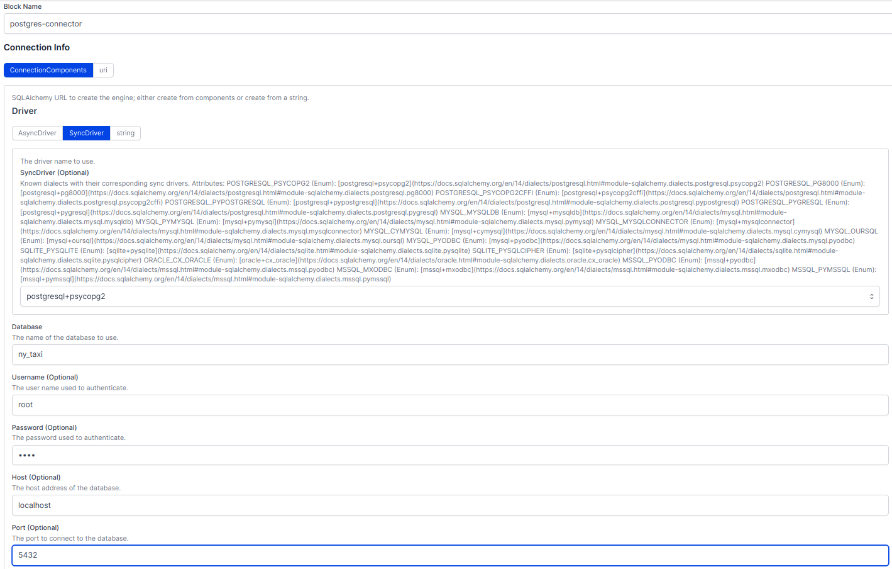

**Step 6:** use the block in the code using this snippet (see [ingest_data_flow_etl_with_sql_block.py](./ingest_data_flow_etl_with_sql_block.py)):

```python
from prefect_sqlalchemy import SqlAlchemyConnector

with SqlAlchemyConnector.load("postgres-connector") as database_block:
    ...
```

## [DE Zoomcamp 2.2.3 - ETL with GCP & Prefect](https://www.youtube.com/watch?v=W-rMz_2GwqQ&list=PL3MmuxUbc_hJed7dXYoJw8DoCuVHhGEQb&index=19)

**Step 1:** write an ETL script for saving data locally and uploading it to GCP (see [etl_web_to_gcs.py](./etl_web_to_gcs.py)).

**Step 2:** run Prefect Orion UI from the terminal.
```
prefect orion start
```

**Step 3:** create a Prefect Block to store our GCP credentials (for generating GCP credentials, see [my notes of DE Zoomcamp 1.3.1 - Introduction to Terraform Concepts & GCP Pre-Requisites](../week1/README.md#de-zoomcamp-131---introduction-to-terraform-concepts--gcp-pre-requisites)), because blocks allow us to reuse configuration with external services, doing it in a secure way.

In the Prefect Orion UI click on "Blocks" and then find the GCS Bucket Block.


**Important note:** if GCS Bucket is not available, go to the terminal and run:
```
prefect block register -m prefect_gcp
```

**Step 4:** configure the GCS Bucket Block as follows. Note that we need to inform the GCP Bucket ID. If no bucket is available, see [my notes of DE Zoomcamp 1.3.2 - Creating GCP Infrastructure with Terraform](../week1/README.md#de-zoomcamp-132---creating-gcp-infrastructure-with-terraform). Additionally, if no GCP Credentials Block has been created yet, we need to create one by clicking on "Add +"


**Step 5:** create a GCP Credentials Block as follows. In this example, I chose to inform the path of my json file that stores my credentials. But I could also have pasted the contents directly in the blue box under "The contents of the keyfile as dict".


**Step 6:** select the GCP Credentials Block that has just been created and click on "Create".

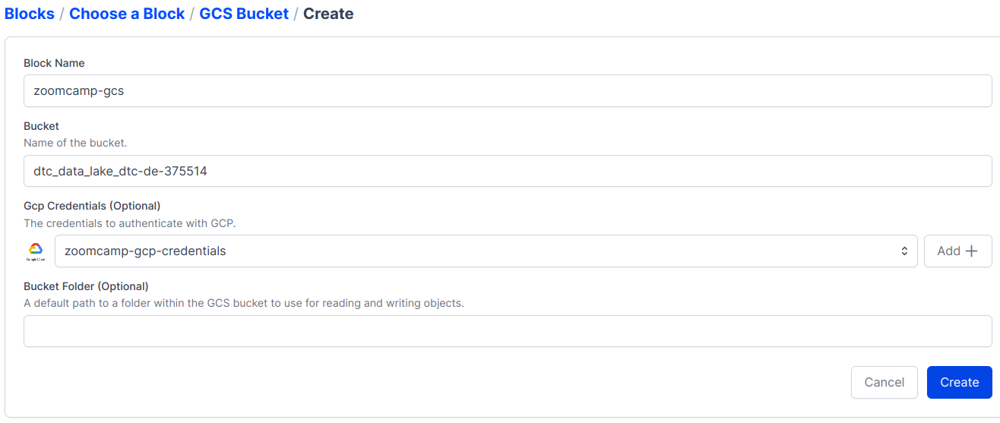

**Step 7:** Prefect shows us how we can use the new block inside a Python script.


**Step 8:** run [etl_web_to_gcs.py](./etl_web_to_gcs.py):
```
python etl_web_to_gcs.py
```

**Step 9:** check the uploaded data in GCP.

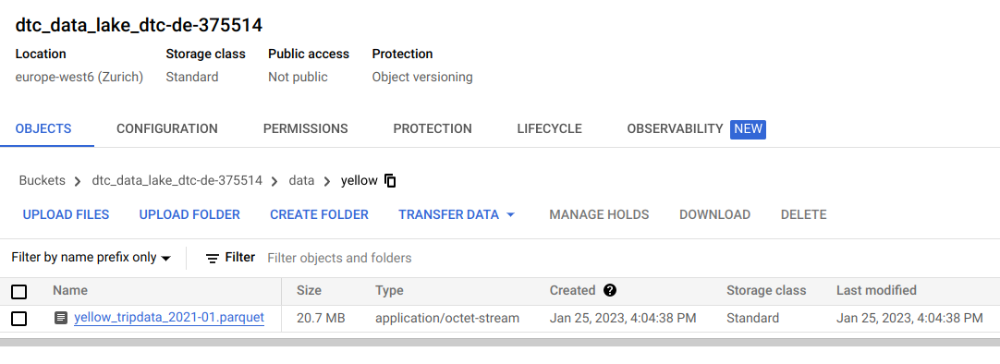

**Step 9:** build the right path to gcp with path lib libary (if the / is opposit its upload the path file without breaking into folder).


local path sam,e directory
```python
  gcs_block.get_directory(from_path=gcs_path, local_path=f"./")
```

## [DE Zoomcamp 2.2.4 - From Google Cloud Storage to Big Query](https://www.youtube.com/watch?v=Cx5jt-V5sgE&list=PL3MmuxUbc_hJed7dXYoJw8DoCuVHhGEQb&index=19)

**Step 1:** implement ETL script to extract data from GCS, transform and load it into BigQuery. See [etl_gcs_to_bq.py](./etl_gcs_to_bq.py), specially the function ```write_to_bq``` (note that we are going to use the [GcpCredentials that we have just created](#de-zoomcamp-223---etl-with-gcp--prefect)).

**Step 2:** create a table in BigQuery. In my project, I already have a dataset named trips_data_all, [which was created using Terraform](../week1/README.md#de-zoomcamp-132---creating-gcp-infrastructure-with-terraform). For such, in the explorer menu click on the three dots and choose "Create table".


Next, fill the form as below and click on "Create".

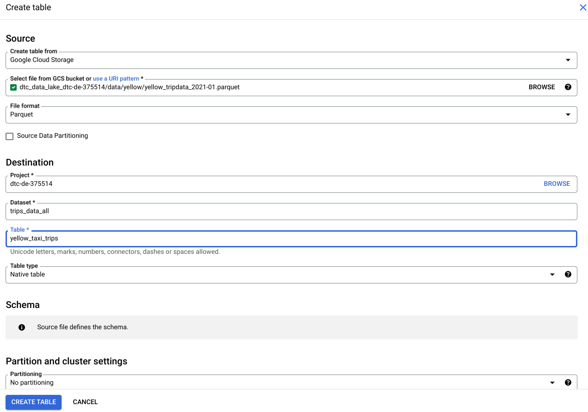

**Step 4:** since we create the table using our dataset stored in GCS as a template, BigQuery has already populated our dataset. To test our script, let's delete all data. First, click on the table we have just created (under trips_data_all) and on "Query".

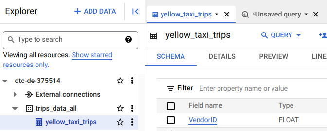

Afterwards, type and run the following SQL statement:


Under "Query Results" we should get a message like this one:


**Step 5:** run ETL script.
```
python etl_gcs_to_bq.py
```

Now, if we click on our table and "Preview", we can see our records:


## [DE Zoomcamp 2.2.5 - Parametrizing Flow & Deployments with ETL into GCS flow](https://www.youtube.com/watch?v=QrDxPjX10iw&list=PL3MmuxUbc_hJed7dXYoJw8DoCuVHhGEQb&index=21)

**Step 1:** a flow can have multiple runs with different paremeters that affect the outcome. Therefore, we reimplement [etl_web_to_gcs.py](./etl_web_to_gcs.py) to reuse the same flow to update different taxi trips datasets to GCP, see [parameterized_flow.py](./parameterized_flow.py). After running this new code, we can see the results in the GCS Bucket.

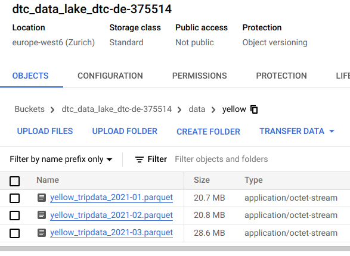

In Prefect Orion UI we can check our flow and its subflows.


**Step 2:** deploy the workflow using Prefect to avoid the need for triggering our workflow manually. In the terminal, we run the command shown below, which outputs a YAML file containing the workflow's deployment metadata.
```
prefect deployment build ./parameterized_flow.py:etl_parent_flow -n "Parameterized ETL"
```

**Step 3:** in the metadata YAML file, we find the line containing ```parameters : {}``` and add the parameters that we want to run.
```yaml
parameters : { "color": "yellow", "months": [1, 2, 3], "year": 2021 }
```

**Step 4:** create deployment on the API.
```
prefect deployment apply etl_parent_flow-deployment.yaml
```

We can see the deployment in the Prefect Orion UI.

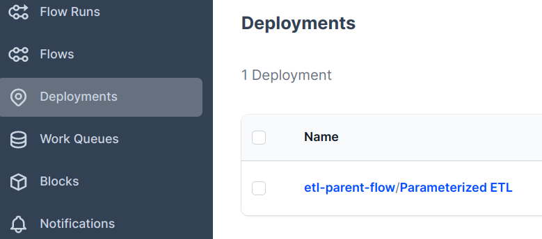

**Step 5:** trigger a quick run from the UI.


**Step 6:** after triggering a quick run, it will have a "Scheduled" state under "Flow runs". To deploy this workflow for execution, we need an agent.

Agents consist of lightweight Python processes in our execution environment. They pick up scheduled workflow runs from Work Queues.

Work Queues coordinate many deployments with many agents by collecting scheduled workflow runs for deployment according to some filtering criteria.

Some nice references for better understanding the roles of Agents and Work Queues are: [Agents and Work Queues (Prefect docs)](https://docs.prefect.io/concepts/work-queues/) and [What’s the role of agents and work queues, and how the concept of agents differ between Prefect 1.0 and 2.0?](https://discourse.prefect.io/t/whats-the-role-of-agents-and-work-queues-and-how-the-concept-of-agents-differ-between-prefect-1-0-and-2-0/689)

We launch an agent with the following command. The agent will automatically run our scheduled workflow.
```
prefect agent start --work-queue "default"
```

## [DE Zoomcamp 2.2.6 - Schedules & Docker Storage with Infrastructure](https://www.youtube.com/watch?v=psNSzqTsi-s&list=PL3MmuxUbc_hJed7dXYoJw8DoCuVHhGEQb&index=22)

### How to schedule our workflows?

Suppose we want our workflow to run every 5 minutes. We can do that in Orion UI by clicking on our deployment and on "Add" under "Schedule".


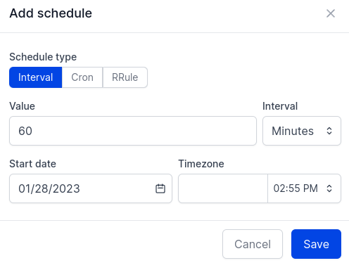

After scheduling, our workflow will be run according to our rule as long as we have an agent to pick it up. Alternatively, we can also use the set the ```--cron``` parameter during deployment.
```
prefect deployment build parameterized_flow.py:etl_parent_flow -n etl2 --cron "0 0 * * *" -a
```

The result of the command above is shown in the figure below ("At 12:00 AM every day").


### How to run our workflows in Docker containers?

**Step1:** we can use Docker images to make our workflows production-ready. First, we write a Dockerfile for our workflow, then login to DockerHub, create an image repository, and finally push the image. In the commands, change "padilha" to your [DockerHub](https://hub.docker.com/) username.

```
docker image build --no-cache -t padilha/prefect:zoom .

docker login

docker image push padilha/prefect:zoom
```

**Step 2:** we need to create a Docker infrastructure block. In this step, I created a block named "zoom" and set the values of "Image", "ImagePullPolicy" and "Auto Remove".

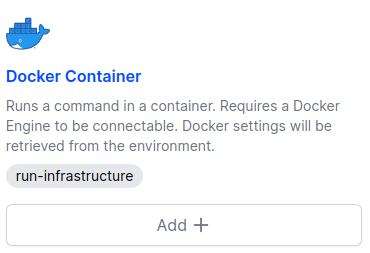

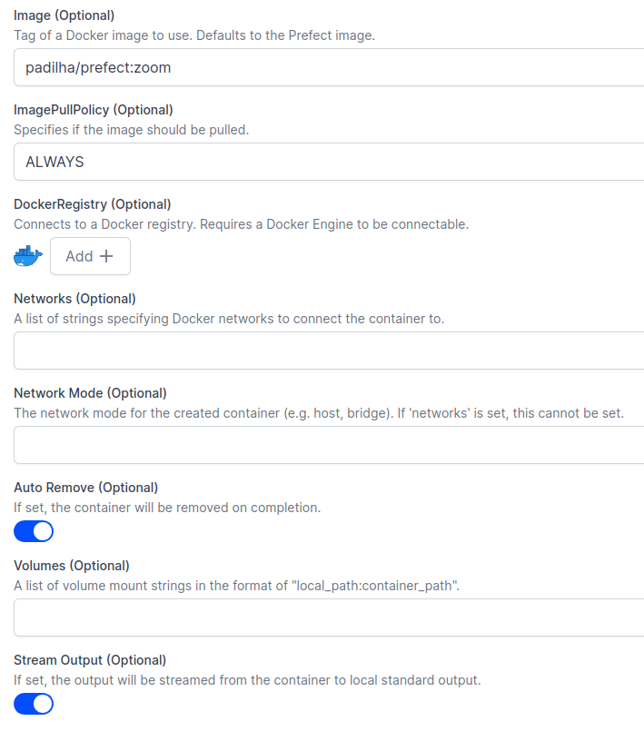

It is also possible to create blocks using Python code. See [blocks](./blocks/) for some examples presented in the course.

**Step 3:** create deployment. This time, we deploy our container using Python code, see [docker_deploy.py](./docker_deploy.py).

```
python docker_deploy.py

prefect config set PREFECT_API_URL=http://127.0.0.1:4200/api

prefect agent start -q default

prefect deployment run etl-parent-flow/docker-flow -p "months=[1,2]"
```

Then, we can see the result in our GCS Bucket.

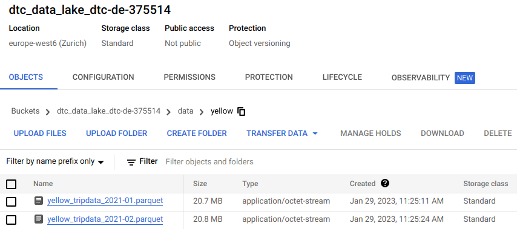

**Problems during Step 3:** I had two different types of problems, which took me some time to find the solution. I list them and their solutions below.

**Problem #1:**

    ...
    ValueError: Path /home/padilha/.prefect/storage/c3ec11659da6459f8cfafe36de0bcaab does not exist.

    Finished in state Failed('Flow run encountered an exception. ValueError: Path /home/padilha/.prefect/storage/c3ec11659da6459f8cfafe36de0bcaab does not exist.\n')

For some reason, the above exception has something to do with the task caching parameters that we set in the function ```fetch``` in [parameterized_flow.py](./parameterized_flow.py). The easiest solution to this problem is to remove ```cache_key_fn``` and ```cache_expiration``` parameters. See this [thread in Slack](https://datatalks-club.slack.com/archives/C01FABYF2RG/p1674823816614039) and this [issue in GitHub](https://github.com/PrefectHQ/prefect/issues/6086).

**Problem #2:**

    ...
    pydantic.error_wrappers.ValidationError: 1 validation error for GcsBucket gcp_credentials -> service_account_file
    The provided path to the service account is invalid (type=value_error)

    The above exception was the direct cause of the following exception:
    ...
    RuntimeError: Unable to load 'zoomcamp-gcs' of block type None due to failed validation. To load without validation, try loading again with `validate=False`.

In my implementation, when creating the GCS Bucket block, I used a "Service Account File" to set the value of the GCP Credentials block. Then, the JSON file cannot be found by Prefect inside the Docker container. To circumvent this problem, we can just edit our GCP Credentials block and paste the content of our Service Account File as a secret dictionary ("Service Account Info") in the block. See this [thread in Slack](https://datatalks-club.slack.com/archives/C01FABYF2RG/p1674761874766169).

## [DE Zoomcamp 2.2.7 - Prefect Cloud/Additional resources](https://www.youtube.com/watch?v=gGC23ZK7lr8&list=PL3MmuxUbc_hJed7dXYoJw8DoCuVHhGEQb&index=23)

* [Prefect Docs](https://docs.prefect.io/)
* [Prefect Cloud](https://www.prefect.io/cloud/)
* [Anna Geller's GitHub](https://github.com/anna-geller)
* [Prefect Community](https://discourse.prefect.io/)